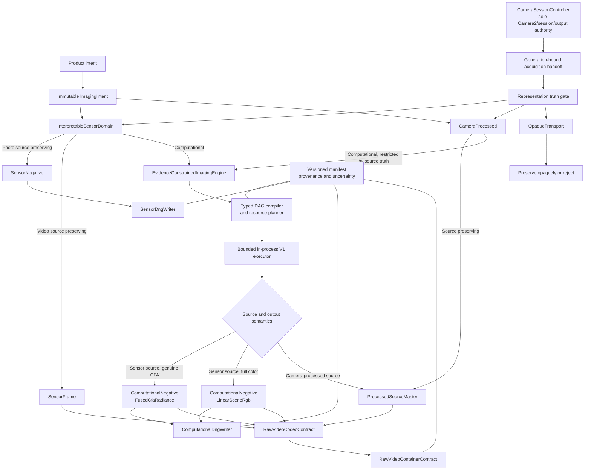
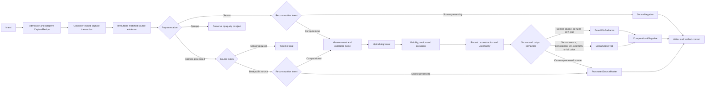
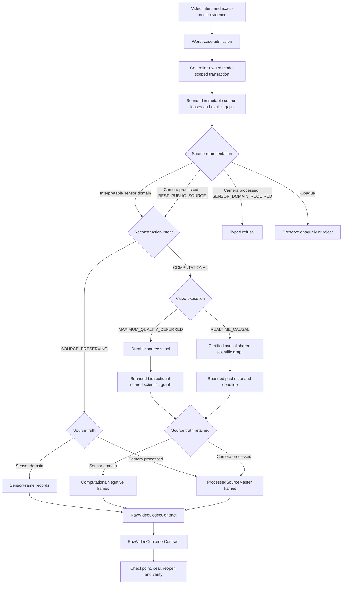

# CamX Computational RAW Architecture — Revision 2

This document defines the semantic and constitutional architecture for future CamX computational
photo and RAW-video work. It extends [Architecture Constitution](ARCHITECTURE_CONSTITUTION.md),
[RAW Transaction Architecture](RAW_ARCHITECTURE.md), [Threading Model](THREADING_MODEL.md),
[Native Memory and JNI Model](NATIVE_MEMORY_MODEL.md), [Resource Ownership](RESOURCE_OWNERSHIP.md),
and [Performance Budgets](PERFORMANCE_BUDGETS.md). Those documents continue to govern the existing
camera foundation. Where an older document describes a future computational-imaging choice that
conflicts with this document, this document is authoritative; it does not weaken any existing
camera-ownership or API-23 invariant.

`MUST`, `MUST NOT`, and `MAY` are normative. A frozen semantic decision may change only through an
explicit Tier-A architecture migration. A technology marked provisional is not a production choice.

## ARCHITECTURE FREEZE

| Field | Value |
|---|---|
| Architecture | CamX Computational RAW Architecture Revision 2 |
| Status | **SEMANTIC / CONSTITUTIONAL FROZEN** |
| Base | `75f56063cd34f802fe1e404574b496412ba3955c` |
| Implementation-specific technologies | **PROVISIONAL UNTIL THEIR GATES PASS** |
| Current implementation frontier | **CAMX-108 — one-shot RAW capture** |

CAMX-108 is not the computational engine. It establishes the trustworthy one-shot sensor acquisition
primitive that later feeds M1. This freeze changes no camera behavior and starts none of M1–M14.

## Scope and decision states

The architecture covers representation truth, computational products, shared photo/video science,
DNG roles, RAW-video serialization boundaries, execution, resource proof, failure separation,
certification, provenance, and the dependency roadmap. Artistic rendering is out of scope.

- **FROZEN**: accepted semantic or constitutional contract.
- **PROVISIONAL**: replaceable candidate with no production commitment.
- **NEEDS PROTOTYPE**: requires the named bounded experiment before selection.
- **NEEDS PHYSICAL PROOF**: support or performance depends on real hardware evidence. CI cannot
  provide that evidence.

An item may need both a prototype and physical proof. Passing a prototype does not silently freeze
the implementation; the result is recorded in its implementation ADR.

## Terminology and sensor truth

- **Public interpretable sensor-domain representation**: public Camera2 output whose sample layout
  and metadata are sufficient for declared interpretation. CamX has not changed its numerical
  samples. This does not claim that the sensor or HAL performed no binning, remosaic, defect
  correction, black-level, shading, or other processing before exposure through Camera2.
- **Camera-processed representation**: publicly interpretable output such as YUV or P010 whose
  samples were produced by the camera processing pipeline.
- **Opaque transport**: output whose numerical interpretation is not established by public runtime
  evidence. In particular, `RAW_PRIVATE` MUST NOT be decoded by guess.
- **Source evidence**: immutable samples, matched metadata, capture identity, and calibration evidence
  delivered by acquisition.
- **SensorFrame**: the immutable video-lane record for one `InterpretableSensorDomain` acquisition,
  including its exact temporal and source evidence. It is a source record, not a reconstructed product
  or a filename-based claim of RAW truth.
- **Negative**: a source-preserving or scene-referred computational master. It is not a rendered look.
- **Canonical lens**: the optical identity established by topology. One reconstruction uses one
  canonical optical lens in Revision 2.

CamX records available evidence and uncertainty. Documentation and UI MUST NOT claim “perfect” or
“untouched” sensor data.

## Constitutional invariants

1. `CameraSessionController` remains the sole `CameraDevice`, `CameraCaptureSession`, session-output,
   `ImageReader`, and camera-callback authority.
2. Processing receives one immutable, generation-bound handoff. It MUST NOT open a camera, configure
   a session, discover topology, change the active lens or canonicalization, or query current UI state
   to reconstruct historical capture identity.
3. Photo and video share one `EvidenceConstrainedImagingEngine` and one family of scientific node
   contracts. Temporal policy and product serialization MAY differ.
4. Sensor mode bypasses every CamX sample-changing reconstruction node.
5. Source representation and product truth are enforced structurally, not by display labels.
6. A processed or opaque input MUST NOT be relabeled as sensor-sourced RAW.
7. Capture is driven by an adaptive, bounded `CaptureRecipe`, never an unqualified fixed frame count.
8. Reconstruction is measurement-model-driven and includes calibrated noise, alignment evidence,
   visibility, occlusion, motion, and propagated uncertainty.
9. A typed immutable graph is compiled and resource-proved before acquisition. An unbounded plan is
   rejected before capture.
10. Algorithm meaning is independent of execution backend. A deterministic scalar CPU implementation
    is the reference; every optimization is differentially qualified against it.
11. All memory, metadata, queues, temporal windows, burst counts, pools, indexes, and writer state are
    bounded with explicit overflow and cancellation behavior.
12. No path uses OOM as a capability probe, silently drops arbitrary RAW-video frames, performs heavy
    work on Camera2 callbacks, or performs I/O inside camera mutation ownership.
13. Source retention is transactional. Source deletion follows successful reopen, semantic
    validation, digest verification, and output commit.
14. Every serialized product retains exact source and processing provenance in a versioned manifest.
15. Support is certified for an exact profile and environment. Brand, model, SoC, sensor name, GPU
    marketing name, numeric camera ID, focal-role assumptions, and resolution are not routing policy.
16. AI is optional, measurement-constrained, versioned, bounded, and removable. It is never the sole
    correctness path for required behavior.
17. Negative production stops before artistic tone, look, beautification, or social-media rendering.
18. V1 compute is bounded and in-process. No `Service`, `ForegroundService`, `JobService`, or
    `WorkManager` exists merely to host computation.

The accepted semantic decisions are also recorded in the computational-imaging ADR set beginning at
ADR-014. Candidate implementations are isolated in the proposed prototype ADR.

## Architecture overview



Replacing a DNG library, compressed codec, or container MUST NOT change `SensorFrame`, product types,
camera ownership, capture architecture, the processing graph, or reconstruction semantics.

## Source representation model

The conceptual closed hierarchy is:

```text
AcquiredRepresentation
├── InterpretableSensorDomain
├── CameraProcessed
└── OpaqueTransport
```

Each acquired source carries immutable capture identity, canonical lens, route/profile, sensor pixel
mode, public representation descriptor, exact dimensions and active area, timestamps and timebase,
matched metadata, calibration identity, source digest, generation, and explicit missing evidence.

Hard rules:

- YUV and P010 can never produce `SensorNegative`.
- A camera-processed source MAY use shared scientific components, but its artifact remains a
  `ProcessedSourceMaster` with its processed provenance.
- Opaque transport is preserved opaquely or rejected. It is not scientifically decoded by inference.
- Storage unpacking, endian normalization, and padding removal do not by themselves change numerical
  samples, but every transformation remains recorded.
- Every source and product declares its representation; consumers fail closed on unknown required
  semantics.

## Product model and user intent

The product hierarchy is conceptually:

```text
SensorNegative<InterpretableSensorDomain>
ComputationalNegative<InterpretableSensorDomain, ComputationalPixelRepresentation>
ProcessedSourceMaster<CameraProcessed, ProcessedPixelRepresentation>

ComputationalPixelRepresentation
├── FusedCfaRadiance
└── LinearSceneRgb
```

`SensorNegative` contains one public interpretable sensor-domain capture with no CamX sample-changing
processing. `ComputationalNegative` contains a reconstructed product derived from sensor-domain
evidence. `ProcessedSourceMaster` preserves or reconstructs camera-processed evidence without
claiming sensor provenance. Its `ProcessedPixelRepresentation` truthfully names the actual
camera-processed or derived layout and photometric domain; it is not `FusedCfaRadiance` or
`LinearSceneRgb` merely because similar storage primitives are used.

`FusedCfaRadiance` is legal only on a genuine CFA grid with a truthful pattern and phase.
Joint demosaic, super-resolution, geometry reconstruction, or full-color reconstruction produces
`LinearSceneRgb`. CamX MUST NOT remosaic `LinearSceneRgb` merely to make a Bayer-looking artifact.

The stable user semantics are four independent axes:

| Axis | Values |
|---|---|
| `ReconstructionIntent` | `SOURCE_PRESERVING`, `COMPUTATIONAL` |
| `SourcePolicy` | `SENSOR_DOMAIN_REQUIRED`, `BEST_PUBLIC_SOURCE` |
| `VideoExecution` | `MAXIMUM_QUALITY_DEFERRED`, `REALTIME_CAUSAL` |
| `SourceRetention` | `KEEP_SOURCE`, `DELETE_AFTER_VERIFIED_OUTPUT` |

Future UI MAY simplify these to Sensor and Computational modes, but requested mode, actual source,
fallback, and actual product MUST remain separately visible and serialized.

## Photo graph



Frame count, exposure policy, stopping condition, temporal support, and fallback are outputs of the
admitted `CaptureRecipe`. A recipe MUST have hard bounds. One canonical lens is used per
reconstruction; multi-lens fusion requires a future architecture migration.

## Video graph



Admission reserves the `PACKED_NONE` worst case, container overhead, durability lag, queue slots, and
memory before recording. `MAXIMUM_QUALITY_DEFERRED` may use past and future frames. V1 progresses only
while foreground lifecycle permits; durable state enables explicit later resume but grants no
background entitlement. `REALTIME_CAUSAL` uses current and past evidence only.

Software overload MUST cause an explicit certified fallback, representation epoch, or controlled
stop—never an unrecorded arbitrary frame drop. Camera-originated gaps remain explicit records.
`SENSOR_DOMAIN_REQUIRED` stops rather than changing source class. `BEST_PUBLIC_SOURCE` may begin a
declared processed-source epoch, never fake RAW.

## Computational-negative semantics

A `ComputationalNegative` records:

- output representation, dimensions, active area, precision, photometric domain, and color semantics;
- canonical lens, source profiles, source frame IDs and digests;
- capture, calibration, noise, alignment, visibility, motion, and occlusion evidence;
- uncertainty semantics and available confidence summaries or maps;
- graph, node algorithm, parameter-schema, backend, precision, and model versions;
- every fallback, rejection, clipping condition, and unavailable evidence;
- output digest and a binding to the processing manifest.

It does not contain an artistic look. Dense maps MAY be external, but their identity and digest are
manifest-bound. If a standardized output cannot represent the declared semantics truthfully, CamX
MUST retain a truthful non-DNG computational master rather than fabricate metadata.

### Rendering boundary

Computational-negative production stops before tone mapping, beautification, skin smoothing,
artistic contrast, saturation styling, JPEG sharpening, look LUTs, and social-media processing.
Those operations belong to a separate future rendering architecture and MUST NOT be hidden inside a
capture recipe, scientific node, writer, codec, container, or fallback.

## DNG architecture

`SensorDngWriter` and `ComputationalDngWriter` are separate frozen contracts, even if a future
implementation shares low-level TIFF utilities.

| Contract | `SensorDngWriter` | `ComputationalDngWriter` |
|---|---|---|
| Input | One `SensorNegative` | One completed `ComputationalNegative` |
| Purpose | Truthful sensor-domain DNG | Truthful reconstructed CFA or Linear DNG |
| Metadata authority | Exact immutable matched capture evidence | Reconstructed output semantics and provenance |
| Camera access | Forbidden | Forbidden |
| Sample-changing reconstruction | Forbidden | Already completed before writer entry |
| Candidate implementation | Android `DngCreator` where truthful | Prototype-selected standards writer |
| Failure | Typed unsupported/write/validation failure | Typed DNG-ineligible result and truthful non-DNG master |

Frozen rules:

- Sensor DNG represents one sensor-domain capture with no CamX sample-changing processing.
- CFA Computational DNG is legal only for a genuine `FusedCfaRadiance` grid and declares its true CFA
  pattern, phase, active area, calibration, levels, and output-derived noise semantics.
- Linear DNG is used for `LinearSceneRgb`, including demosaiced, super-resolved, geometry-reconstructed,
  or other full-color results. CFA tags are not retained.
- YUV, P010, and other `CameraProcessed` products MUST NOT be labeled as Sensor or Computational RAW.
- Metadata MUST NOT be invented to satisfy a writer or decoder, and a source frame's metadata MUST NOT
  be copied wholesale onto a reconstructed output.
- Standards validity and real decoder interoperability are separate gates.

Android `DngCreator` MAY implement truthful supported `SensorDngWriter` cohorts. The exact
`ComputationalDngWriter` technology is **PROVISIONAL / NEEDS PROTOTYPE (M8B)**. Candidates include a
direct standards writer or a suitable SDK path after API-floor, ABI, license, bounded-memory,
security, and interoperability review. Failure to qualify a DNG implementation does not change the
negative's semantics.

## RAW-video container contract

`RawVideoContainerContract` is **FROZEN**. It accepts neutral encoded records; it does not know
Camera2 ownership or reconstruction algorithms. The contract requires:

- recording, artifact, track, frame ordinal, source, and product identity;
- sensor, host, and normalized timestamps with timebase, measured relationship, and uncertainty;
- canonical lens, profile, route, pixel mode, stream configuration, and certification identity;
- exact dimensions, active area, plane/sample layout, precision, CFA semantics, photometric domain,
  calibration identity, and explicit missing fields;
- bounded public Camera2 metadata needed for interpretation or certification;
- source/output hashes, graph/algorithm/model versions, processing history, confidence, uncertainty,
  gyro/OIS evidence, and final manifest binding;
- representation epochs, codec epochs, explicit gaps, and schema/version negotiation;
- bounded sequential append, bounded indexes and parser allocations, 64-bit offsets, and large files;
- independently recoverable units, atomic record/group commit, durable checkpoints, layered integrity,
  sealing, truncation/crash/power-loss recovery, corruption isolation, and bounded random access;
- fail-closed behavior for unknown required fields and malformed or adversarial sizes.

A checkpoint is acknowledged only after the contract's declared durable state has completed; a
memory flush alone is insufficient. Recovery may lose only its declared uncommitted tail and MUST
preserve acknowledged independently sealed units.

MCAP-based CXRB is the leading **PROVISIONAL / NEEDS PROTOTYPE (M2A)** candidate, not a frozen file
format. M2A MUST prove sustained throughput, append/checkpoint/seal latency, CPU, copies, memory and
memory slope, energy, metadata/index overhead, random access, recovery bounds, corruption radius,
schema evolution, fuzz safety, files beyond 4 GiB, truncation and real power-loss behavior, and long
thermal soak on supported ABIs/storage classes. Rejection of MCAP/CXRB replaces only the adapter.

## RAW-video codec contract

`RawVideoCodecContract` and `PACKED_NONE` are **FROZEN**. `PACKED_NONE` serializes canonical meaningful
raster bytes and an exact descriptor; it MUST exclude arbitrary Android allocator padding.

Every compressed codec is optional and MUST be:

- reversible and bit-exact for its declared input representation;
- versioned, replaceable, and independent of the container;
- bounded in workspace, output expansion, runtime, metadata, and cancellation latency;
- independently decodable at a declared bounded recovery granularity, preferably frame or tile where
  practical;
- resilient to malformed input through pre-allocation validation and fuzzing;
- explicit about pretransform, CFA pattern/phase, restart boundaries, and decoded digest.

Admission MUST reserve `PACKED_NONE` plus framing and durability margin. It MUST NOT depend on an
expected compression ratio. Expansion, deadline miss, or candidate failure MAY select `PACKED_NONE`
while the source lease remains valid, and the fallback is recorded.

JPEG-LS, CFA-split JPEG-LS, predictor plus Rice, predictor plus Zstd, LZ4 variants, and other justified
reversible codecs are **PROVISIONAL / NEEDS PROTOTYPE (M2B)**. M2B uses a real cross-device corpus of
sensor packings, CFA patterns, ISO/exposure/scene classes, and dimensions plus synthetic/reference
edge-tile, computational-CFA, integer-Linear, and floating-Linear fixtures. It measures exactness,
worst expansion, ratio distributions,
encode/decode tail latency, workspace, energy, thermal stability, random access, corruption isolation,
ABI portability, implementation security, and end-to-end storage behavior. M2B MAY choose different
certified codecs per representation or no compressed codec at all.

## Processing graph, compiler, and resource proof

The immutable typed DAG is the stable scientific architecture. Every edge and node eventually
declares or derives:

- representation, dimensions, active area, precision, photometric domain, and calibration identity;
- capture and temporal identity, uncertainty semantics, and source provenance;
- memory domain, ownership lifetime, mutability, and transfer rule;
- algorithm ID/version, parameter-schema version, and legal backend providers;
- workspace formula, output-size bound, tile/halo, temporal lookback/lookahead, and latency class;
- whether samples, geometry, precision, or representation change;
- cancellation granularity, failure boundary, fallback, and manifest contribution.

Graph compilation performs type/shape/precision legality, capability selection, liveness analysis,
buffer planning, worst-case workspace arithmetic with overflow checks, queue planning, scheduling,
fallback validation, and manifest planning. It MUST reject a plan before acquisition if any resource
bound or required capability cannot be satisfied.

The shared scientific families include adaptive recipe planning, public measurement models,
calibration and calibrated noise, hybrid geometric/flow alignment, visibility/occlusion/motion,
robust fusion/reconstruction, and uncertainty propagation. Exact algorithms remain independently
versioned and testable.

Algorithm semantics are not backend semantics. The deterministic scalar CPU path is the oracle.
SIMD, Vulkan, AI, and future accelerators MUST pass differential correctness, failure, performance,
memory, energy, and physical-device qualification. Runtime capability evidence may select a qualified
provider; manufacturer, model, SoC, or marketing identity may not.

## Execution and concurrency model

V1 is **FROZEN** as lifecycle-scoped, bounded, and in-process:

```text
CameraSessionController dispatcher
    -> pre-reserved immutable acquisition handoff
    -> ImagingJobCoordinator
         -> fixed-capacity CPU/native worker pool
         -> one GPU submission/context actor
         -> bounded native buffer arenas
         -> bounded sequential source/output writer
         -> typed DAG scheduler and cooperative cancellation
    -> reopen, validate, digest and commit
```

The processing state machine is distinct from camera state:

```text
PLANNED -> ADMITTED -> ACQUIRING -> INGESTED_OR_DURABLE
        -> EXECUTING -> WRITING -> VERIFYING -> COMMITTED
        -> CANCELLED | FAILED -> deterministic cleanup
```

Capture admission reserves all source slots, queue entries, graph workspace, native pools, writer
state, and output budget before camera mutation. Camera callbacks only validate permits and transfer
bounded leases. Processing has its own generation and cancellation token. Cancellation never transfers
ownership. Preview restoration waits only for acquisition resources to be released or durably spooled,
not for reconstruction completion.

V1 MUST NOT create a service or process merely for compute. A fatal native memory error cannot be
contained by worker threads in the same process; V1 therefore provides deterministic cleanup and
durable recovery for typed failures, not a false claim of fatal native crash isolation.

A separate restartable process is a **PROVISIONAL FUTURE OPTION** requiring a dedicated Tier-A ADR and
prototype of API-23 IPC, handle/file-descriptor transfer, bounded messages, lifecycle, process death,
idempotent recovery, memory duplication, GPU recreation, security, and zero Camera2 ownership.
Process isolation and background execution are separate product decisions.

## AI trust boundary

AI MAY eventually estimate scene state, propose capture decisions inside deterministic limits, refine
noise/alignment/visibility, supply reconstruction priors, detect artifacts, or predict quality/OOD
state. AI MUST NOT:

- alter Sensor-mode samples or fabricate calibration;
- change canonical camera identity or hide clipping, occlusion, gaps, or uncertainty;
- call processed input Sensor RAW;
- bypass admission, memory, latency, or cancellation bounds;
- become the only correctness path for required functionality.

Each learned node records model identity and hash, version, runtime/backend, precision, confidence/OOD
state, fallback, and whether the learned prior affected output pixels. Removing or quarantining the
model returns execution to the deterministic classical path without changing source truth.

## Universality and exact-profile certification

Production behavior MUST be selected from public runtime capability and measured evidence. It MUST
NOT branch on manufacturer, device model, SoC, GPU marketing name, sensor name, numeric camera ID,
hardcoded focal role, or resolution-based optical identity. A narrowly fingerprinted compatibility
rule follows the exception process in the Architecture Constitution and never becomes normal policy.

A support certificate is keyed at least by:

- canonical lens and exact route/profile;
- sensor pixel mode, source format, size, frame rate/exposure policy, and stream combination;
- dynamic-range/color and stabilization configuration where relevant;
- provider, OS, ABI, algorithm, model, container, and codec versions;
- storage target class and required resource/thermal environment.

Certification uses the following evidence vocabulary:

```text
DISCOVERED
ADVERTISED
CONFIGURATION_VERIFIED
FRAME_VERIFIED
SENSOR_PHOTO_CERTIFIED
COMPUTATIONAL_PHOTO_CERTIFIED
SENSOR_VIDEO_SUSTAINED
COMPUTATIONAL_VIDEO_OFFLINE_CERTIFIED
COMPUTATIONAL_VIDEO_REALTIME_CERTIFIED
INTEROPERABILITY_CERTIFIED
```

Discovery, configuration/frame proof, photo, video, and interoperability are distinct evidence lanes;
an unrelated lane is not an artificial prerequisite. Within a claimed lane, CamX MUST possess every
applicable earlier proof and MUST NOT infer a later state from a different lane.

CI, emulator, standards validation, and physical-device results remain distinct evidence classes.
A green build, emulator launch, or static APK/ELF inspection MUST NOT be reported as physical support.

## Processing manifest and source retention

Every output binds a compact versioned manifest sufficient to answer:

- which immutable sources, hashes, frames, camera/lens/routes, representation, and `CaptureRecipe`;
- which calibration, timebase, gaps, and uncertainty evidence;
- which graph, algorithms, parameter schemas, precision, backends, and fallbacks;
- which learned models and hashes;
- which container/codec/writer schema versions;
- which output digest, validation result, and certification cohort.

Large debug traces and dense diagnostic maps MAY remain external, but their identifiers and digests
are bound when required for interpretation or audit.

`KEEP_SOURCE` retains source evidence. `DELETE_AFTER_VERIFIED_OUTPUT` deletes it only after the staged
write completes, the output reopens, semantic validation succeeds, the digest matches, and the
transaction commits. Cleanup failure is reported. Deletion destroys complete future reprocessing and
reproducibility even though the surviving output remains auditable from its manifest; product UX MUST
state that consequence.

## Failure separation

- Camera/session structural failure affects only the exact profile evidence permitted by existing
  camera trust rules.
- Storage, DNG, codec, container, graph, backend, cancellation, and validation failure MUST NOT damage
  camera route or topology trust.
- Unsupported representation or missing required metadata fails as a typed product/admission result,
  not as guessed interpretation.
- GPU/AI/provider failure quarantines or falls back only where a precompiled legal fallback exists.
- Partial products remain unpublished. Source remains authoritative until verified output commit.
- Stale generations close only their own resources and cannot publish into current camera or job state.
- Representation changes, source gaps, codec fallback, and unavailable evidence are explicit manifest
  events, never hidden quality adjustments.

## Performance constitution

The following are hard architecture requirements rather than tuning advice:

- bounded memory, metadata, queues, burst count, temporal window, native pools, writer state, indexes,
  parser allocations, cancellation latency, and retry count;
- no unbounded full-frame stack and no full-RAW Java `ByteArray` pipeline;
- high-resolution processing uses tiles or another incrementally bounded plan;
- no OOM probing, arbitrary sleeps, busy waits, polling loops, thread-per-frame, or unbounded executor;
- no capability discovery on shutter, acquisition, or processing hot paths;
- no discovery, file I/O, compression, DNG encoding, or scientific work on the Camera2 mutation path;
- capture begins only after worst-case resource reservation;
- no arbitrary silent RAW-video drops; sustained overload is explicit fallback or controlled stop;
- benchmarks report distributions, memory slope, copies, energy, thermal state, capability/profile,
  backend, storage class, and artifact/schema versions.

Performance acceptance is cohort-specific. M2A and M2B initially require thermal-steady-state service
capacity of at least `1.25 x` the exact admitted source rate, no growing queue, and all declared memory
bounds. Later milestone budgets are declared before measurement and cannot be retrofitted to a result.

## Milestone roadmap

Dependency order:

```text
M0 -> M1
M1 -> {M2A, M2B, M3, M8A}
M3 -> M4 -> M5 -> M6 -> M7
M7 -> {M8B, M9}
M2A + M2B + M4 -> M10
M7 + M10 -> M11
M9 + M10 + M11 -> M12
M7 + M11 -> M13 -> M14
```

M8A is numbered with the DNG lane but may execute after M1. Each milestone below freezes its own
scope, evidence, and rollback boundary. Before implementation begins, its implementation plan MUST
replace qualitative bounds with numerical budgets appropriate to the admitted cohort.

### M0 — Architecture semantic freeze

- **Goal:** Establish one authoritative Revision 2 semantic and constitutional baseline.
- **Inputs:** The accepted Camera2 foundation, CAMX-108 frontier, Revision 2 review, and existing
  architecture documents and ADRs.
- **Outputs:** This master document, the accepted semantic ADRs, the proposed prototype ADR, and
  reconciled cross-document terminology.
- **Allowed modules:** Architecture, ADR, policy, roadmap, and documentation-validation material only.
- **Forbidden changes:** Production source, build behavior, candidate selection, and implementation of
  any computational milestone.
- **Tests:** Cross-link, decision-state, terminology, contradiction, whitespace, and architecture-guard
  checks.
- **Performance acceptance:** Not applicable; M0 makes no runtime or throughput claim.
- **Hardware acceptance:** Not applicable; M0 makes no physical-device support claim.
- **Rollback boundary:** Revise or revert only the documentation freeze; the accepted camera
  foundation remains unchanged.

### M1 — Immutable acquisition model and source corpus

- **Goal:** Turn the trustworthy CAMX-108 one-shot primitive into a typed immutable evidence handoff
  and a representative real-source corpus.
- **Inputs:** Generation-bound CAMX-108 image/metadata evidence, canonical lens/profile identity, and
  public representation descriptors.
- **Outputs:** Bounded acquisition records, one-time ownership transfer, validated source descriptors,
  source hashes, and a versioned corpus with explicit missing evidence.
- **Allowed modules:** Acquisition value types, bounded ingest/handoff code, source validators, corpus
  capture tooling, and corpus schemas.
- **Forbidden changes:** A second Camera2 owner, computational graph, burst or video capture, guessed
  `RAW_PRIVATE` interpretation, live-UI identity lookup, or premature change to CAMX-108 behavior.
- **Tests:** One-time transfer/close, generation mismatch, metadata matching, plane/layout validation,
  malformed input, hash, cancellation, and resource-release tests.
- **Performance acceptance:** Camera callbacks perform only bounded permit validation and lease
  transfer; handoff memory and latency budgets are declared and met without queue growth.
- **Hardware acceptance:** Corpus spans exact physical profiles, public formats/packings, CFA phases,
  sizes, ISO/exposure ranges, pixel modes, and representative scenes; evidence remains cohort-scoped.
- **Rollback boundary:** Disable the typed handoff/corpus path and retain the accepted one-shot capture
  transaction.

### M2A — RAW-video container prototype

- **Goal:** Determine whether MCAP-based CXRB, or another adapter, satisfies the frozen
  `RawVideoContainerContract`.
- **Inputs:** M1 corpus records, exact descriptors and metadata, explicit gaps/epochs, and
  `PACKED_NONE` payloads.
- **Outputs:** A measured candidate decision, reader/writer/recovery prototype, schema-evolution record,
  and an implementation ADR that accepts or rejects the candidate.
- **Allowed modules:** Isolated container, storage, indexing, reader, recovery, fuzz, and benchmark
  adapters and harnesses.
- **Forbidden changes:** `SensorFrame`, product semantics, graph, codec contract, reconstruction,
  Camera2 ownership, or promotion of MCAP/CXRB before the gate passes.
- **Tests:** Bit-preserving round trip, malformed sizes, fuzzing, schema evolution, truncation, crash and
  real power-loss recovery, corruption radius, random access, checkpoints, sealing, and files larger
  than 4 GiB.
- **Performance acceptance:** Thermal-steady-state service capacity is at least `1.25 x` the exact
  admitted source rate with bounded memory slope, indexes, copies, CPU, energy, append latency,
  checkpoint latency, seal latency, and declared recoverable tail.
- **Hardware acceptance:** Passes a supported ABI and storage-class matrix, including long thermal
  soaks and real durability/power-loss experiments on physical devices.
- **Rollback boundary:** Reject and replace only the container adapter; frozen data, codec, capture,
  graph, photo, and video contracts remain intact.

### M2B — RAW codec benchmark

- **Goal:** Qualify zero or more reversible compressed codecs against the mandatory `PACKED_NONE`
  baseline.
- **Inputs:** The M1 cross-device sensor corpus plus synthetic/reference computational CFA, integer
  Linear, and floating Linear codec fixtures with edge dimensions and declared semantics.
- **Outputs:** Per-representation benchmark evidence, certified codec profiles or `PACKED_NONE` alone,
  reference decoders, and an implementation ADR.
- **Allowed modules:** Replaceable codec/pretransform adapters, reference decoders, corpus runners,
  fuzzers, and performance harnesses.
- **Forbidden changes:** Lossy output, undeclared cross-frame dependencies, container coupling,
  optimistic-compression admission, unbounded expansion/workspace, or a permanently selected codec
  without evidence.
- **Tests:** Property and bit-exact round trips, edge tiles, CFA phase, restart boundaries, worst-case
  expansion, corruption isolation, malformed input, fuzzing, cancellation, and ABI portability.
- **Performance acceptance:** Report ratio distributions, worst expansion, encode/decode p50/p95/p99,
  workspace, copies, random-access cost, energy, and thermal behavior; any sustained path must meet at
  least `1.25 x` its exact admitted source rate without queue growth.
- **Hardware acceptance:** Passes the declared physical device/ABI/representation/thermal matrix with
  end-to-end storage behavior included.
- **Rollback boundary:** Disable the failed compressed codec and use `PACKED_NONE`; no upstream or
  container contract changes are permitted.

### M3 — Reference graph, compiler, resource planner, and V1 executor

- **Goal:** Realize the typed scientific DAG and prove every admitted execution is finite before
  acquisition.
- **Inputs:** Frozen representation/product/node contracts, M1 descriptors/corpus, and declared
  algorithm/workspace formulas.
- **Outputs:** Immutable graph IR, compiler, legality checks, liveness/buffer plan, deterministic scalar
  reference provider, manifest plan, and bounded in-process executor.
- **Allowed modules:** Graph types, compiler, resource planner, scalar node providers, bounded scheduler,
  arenas, cancellation, and synthetic/corpus harnesses.
- **Forbidden changes:** Camera/session ownership, background service, separate process, production
  Vulkan/AI, rendering, unbounded executor/queue, or OOM-based probing.
- **Tests:** Type/shape/precision rejection, arithmetic overflow, illegal backend/fallback, liveness,
  buffer reuse, cancellation, saturation, determinism, leak, and fault-injection tests.
- **Performance acceptance:** Runtime allocations remain within the compiled plan; declared queue,
  workspace, cancellation-latency, tile/halo, and scalar-reference budgets hold under saturation.
- **Hardware acceptance:** Foreground lifecycle and resource cleanup pass on API 23 and representative
  physical memory classes; this does not certify reconstruction quality.
- **Rollback boundary:** Disable the computational engine and preserve source acquisition and
  source-preserving products.

### M4 — Bounded adaptive burst acquisition

- **Goal:** Acquire the finite adaptive `CaptureRecipe` needed by a pre-admitted graph without
  weakening controller ownership.
- **Inputs:** M3 resource reservation and recipe contract plus M1 immutable evidence primitives.
- **Outputs:** Controller-owned burst transaction, bounded `FrameSet`, explicit stopping reason, and
  preview-restoration result.
- **Allowed modules:** Capture planning/admission value types and narrow transaction hooks owned by
  `CameraSessionController`.
- **Forbidden changes:** Permanent idle RAW surfaces, fixed unqualified frame counts, Camera2 callback
  processing, discovery on shutter, hidden lens/canonicalization switch, or processing-owned capture.
- **Tests:** Callback ordering, partial metadata/image arrival, timeout, overflow refusal, cancellation,
  stale generation, close races, preview restore, and repeated leak tests.
- **Performance acceptance:** All slots and buffers are reserved before mutation; callback work,
  capture duration, burst bound, cleanup latency, and preview-return budgets are declared and met.
- **Hardware acceptance:** Exact-profile burst capture proves metadata matching, frame delivery, bounded
  resource use, thermal behavior, and repeatable preview restoration on physical devices.
- **Rollback boundary:** Reject computational burst admission and fall back to the accepted one-shot
  source path.

### M5 — Calibration, measurement, and noise models

- **Goal:** Convert public source evidence into calibrated measurements and uncertainty-aware noise
  models.
- **Inputs:** M4 frame sets, public metadata/calibration, source descriptors, and M1 corpus evidence.
- **Outputs:** Versioned scalar measurement/calibration/noise nodes, confidence/uncertainty records, and
  typed rejection for insufficient evidence.
- **Allowed modules:** Calibration parsing, measurement transforms, noise estimators, scalar reference
  nodes, and calibration test tools.
- **Forbidden changes:** Fabricated calibration, marketing/device routing, guessed opaque semantics,
  optimized or learned providers, artistic processing, or silent default certainty.
- **Tests:** Synthetic signal/noise, clipping, black/white level, missing/inconsistent metadata,
  precision, overflow, dark-frame, flat-field, and uncertainty-calibration tests.
- **Performance acceptance:** Reference nodes execute in declared bounded tiles/workspace with finite
  precision/error and cancellation budgets.
- **Hardware acceptance:** Physical ISO, exposure, temperature, pixel-mode, dark/flat, and scene
  evidence validates each exact profile; unsupported profiles fail closed.
- **Rollback boundary:** Reject computational admission for the profile and retain a truthful Sensor or
  processed-source product.

### M6 — Alignment, visibility, motion, occlusion, and uncertainty

- **Goal:** Establish trustworthy correspondence and per-sample usability without forcing fusion.
- **Inputs:** M5 calibrated measurements/noise, capture timing, and available gyro/OIS evidence from M4.
- **Outputs:** Versioned alignment fields, visibility/occlusion/motion masks, confidence, propagated
  uncertainty, and explicit failure/fallback evidence.
- **Allowed modules:** Deterministic scalar geometric/flow alignment, motion/occlusion estimators,
  uncertainty propagation, and reference harnesses.
- **Forbidden changes:** Assumed clock synchronization, invented correspondence, hidden warp, forced
  fusion, unbounded flow/pyramids, device-name policy, or optimized/AI-only correctness.
- **Tests:** Synthetic transforms, rolling shutter, parallax, motion, occlusion, textureless regions,
  clipping, timing uncertainty, numerical determinism, cancellation, and failure injection.
- **Performance acceptance:** Pyramid, tile/halo, temporal, workspace, and cancellation bounds are
  declared and met by the scalar reference path.
- **Hardware acceptance:** Exact-profile physical evidence covers low light, motion, rolling shutter,
  parallax, gyro/OIS availability and timebase uncertainty across representative scenes.
- **Rollback boundary:** Use a constrained alignment, reduce the admitted recipe, or select a single
  reference frame; never publish unsupported fusion.

### M7 — Computational photo reconstruction

- **Goal:** Produce a truthful source-bound `ComputationalNegative` from admitted evidence.
- **Inputs:** M5 measurements/noise, M6 alignment/visibility/uncertainty, M4 frame sets, and the M3
  compiled resource plan.
- **Outputs:** `FusedCfaRadiance` or `LinearSceneRgb` computational negatives, manifests, uncertainty,
  validation results, and verified transactional masters.
- **Allowed modules:** Deterministic reference fusion/reconstruction nodes, product validators,
  manifests, and transactional master writers.
- **Forbidden changes:** RGB remosaicing, artistic rendering, processed-source relabeling, fixed frame
  counts, metadata invention, unqualified backends, or deletion before verified commit.
- **Tests:** Deterministic goldens, synthetic radiometry, HDR/night/motion/ghosting, clipping, CFA phase,
  source-policy fallback, manifest/digest, cancellation, and source-retention transaction tests.
- **Performance acceptance:** Declared bounded tile/halo/workspace and end-to-end latency/memory/energy
  budgets meet a predeclared quality-resource Pareto threshold.
- **Hardware acceptance:** Controlled and real-scene exact-profile evidence proves radiometric,
  artifact, uncertainty, stability, and resource acceptance; CI remains a separate evidence class.
- **Rollback boundary:** Retain the Sensor negative or truthful processed-source master and leave
  source evidence intact.

### M8A — Sensor DNG validation

- **Goal:** Certify truthful Sensor DNG production for supported source cohorts.
- **Inputs:** M1 `SensorNegative`, immutable matched metadata, and exact source descriptors.
- **Outputs:** Validated Sensor DNG artifacts, cohort certificates, interoperability evidence, and typed
  unsupported/write/validation results.
- **Allowed modules:** `SensorDngWriter` adapter, staged-write transaction, independent validators,
  decoder harnesses, and certification records.
- **Forbidden changes:** Sample-changing processing, computational tags, fabricated metadata, writer
  camera access, live-state lookup, or use of `DngCreator` outside truthful supported cohorts.
- **Tests:** Exact raster preservation, required/forbidden tags, active area/CFA/levels, orientation,
  metadata mismatch, truncation, reopen/digest, failure cleanup, and independent decoder tests.
- **Performance acceptance:** Writer memory, copies, latency, cancellation, file size, and transactional
  I/O remain within predeclared bounded budgets.
- **Hardware acceptance:** A physical exact-profile and decoder/application interoperability matrix
  passes for every certified cohort.
- **Rollback boundary:** Disable only the failed Sensor DNG cohort and retain the truthful source
  evidence/master.

### M8B — Computational DNG writer and interoperability

- **Goal:** Select a truthful computational-DNG implementation or establish that the product remains a
  non-DNG computational master.
- **Inputs:** M7 `ComputationalNegative` products and output-derived representation, calibration,
  uncertainty, and manifest semantics.
- **Outputs:** Prototype comparison, validated CFA/Linear DNG cohorts where representable, explicit
  DNG-ineligible results, and an implementation ADR.
- **Allowed modules:** Isolated direct-writer/SDK prototypes, `ComputationalDngWriter` adapter, TIFF/DNG
  utilities, independent validators, fuzzers, and interoperability harnesses.
- **Forbidden changes:** Coercing Android `DngCreator`, copying source tags wholesale, remosaicing
  Linear RGB, inventing metadata, hiding unrepresentable semantics, or changing the negative model.
- **Tests:** Semantic/tag/raster/active-area/precision tests, malformed output, fuzzing, reopen/digest,
  CFA and Linear decoder behavior, and cross-application interoperability.
- **Performance acceptance:** Tile/strip memory, copies, output-size bound, latency, cancellation, and
  validation costs meet declared budgets; API floor, ABI, license, and security gates also pass.
- **Hardware acceptance:** Physical products from certified profiles interoperate across the declared
  decoder/application matrix; standards validation alone is insufficient.
- **Rollback boundary:** Retain the truthful computational negative or non-DNG master and replace only
  the writer adapter.

### M9 — SIMD, Vulkan, and ingest qualification

- **Goal:** Qualify optimized providers without changing reference algorithm meaning or source truth.
- **Inputs:** M3 scalar oracle and graph contracts, M5–M7 reference nodes/goldens, and exact runtime
  capability evidence.
- **Outputs:** Differentially qualified provider profiles, performance/energy evidence, quarantine
  rules, and always-available legal fallback plans.
- **Allowed modules:** SIMD/Vulkan provider adapters, optional public hardware-buffer ingest adapter,
  differential/sanitizer harnesses, and capability certification.
- **Forbidden changes:** Algorithm redefinition, manufacturer/model/SoC/GPU-name routing, GPU-only
  correctness, unconditional later-API linkage, hidden precision change, or unbounded device work.
- **Tests:** Differential outputs/error bounds, sanitizer, precision, synchronization, device loss,
  cancellation, driver fault, fallback, API-23 loading, and resource leak tests.
- **Performance acceptance:** Whole-graph speed, transfer/synchronization cost, memory, energy, and
  thermal behavior must improve the declared Pareto frontier rather than an isolated kernel only.
- **Hardware acceptance:** Passes the declared ABI/GPU/driver/OS/API/device matrix, including API-23
  scalar fallback and long thermal runs.
- **Rollback boundary:** Quarantine the provider or ingest path and execute the same graph with the
  deterministic scalar CPU provider.

### M10 — Sensor RAW video

- **Goal:** Sustain truthful sensor-domain video recording under the frozen container/codec contracts.
- **Inputs:** M4 controller-owned bounded acquisition, M2A selected container adapter, M2B codec set or
  `PACKED_NONE`, and exact-profile evidence.
- **Outputs:** Recoverable Sensor RAW-video artifacts, explicit gaps/epochs, manifests, checkpoints,
  validation results, and cohort certificates.
- **Allowed modules:** Mode-scoped controller transaction, bounded frame leases, codec/container/storage
  adapters, validators, recovery, and certification harnesses.
- **Forbidden changes:** Permanent idle RAW surfaces, computational reconstruction, arbitrary silent
  drops, optimistic compression admission, background services, opaque decoding, or YUV/P010 as RAW.
- **Tests:** Backpressure, queue saturation, camera gaps, codec fallback, full/slow storage, checkpoint,
  truncation, crash/power loss, corruption isolation, reopen/digest, and cancellation tests.
- **Performance acceptance:** Worst-case `PACKED_NONE` admission succeeds only with at least `1.25 x`
  thermal-steady-state writer capacity, bounded queues/memory/indexes, and no growing backlog.
- **Hardware acceptance:** Long physical exact-cohort soaks cover frame/exposure policy, storage class,
  thermal/energy state, crash/power loss, and independent recovery/decoding.
- **Rollback boundary:** Disable the failing cohort, stop cleanly, or fall back to `PACKED_NONE` where
  already admitted; photo and camera trust remain unaffected.

### M11 — Deferred computational RAW video

- **Goal:** Reconstruct maximum-quality temporal negatives from durable source video without a
  realtime or background-completion promise.
- **Inputs:** Durable verified M10 source, M7 reference reconstruction, M3 planner/executor, and
  representation/timebase/gap evidence.
- **Outputs:** Bounded deferred temporal products, checkpoints, resumable manifests, uncertainty, and
  verified transactional output.
- **Allowed modules:** Bounded bidirectional temporal graphs, source readers, product writers,
  checkpoint/resume state, and foreground lifecycle coordination.
- **Forbidden changes:** Realtime claims, background entitlement, hidden rendering, unbounded temporal
  windows, arbitrary gap concealment, or source deletion before output verification.
- **Tests:** Deterministic restart/resume, gap/epoch boundaries, temporal-window edges, idempotence,
  cancellation, corruption, output verification, and source-retention transaction tests.
- **Performance acceptance:** Window, queues, memory, checkpoint state, storage I/O, cancellation, and
  foreground chunk budgets are declared and remain bounded without progress loss after checkpoints.
- **Hardware acceptance:** Physical temporal-quality, storage, energy, memory, lifecycle interruption,
  and long foreground thermal evidence passes for each certified cohort.
- **Rollback boundary:** Discard the partial unpublished product and retain the verified Sensor RAW
  source for retry or export.

### M12 — Realtime computational RAW video

- **Goal:** Produce certified causal computational negatives within each admitted frame deadline.
- **Inputs:** M9 qualified providers, M10 sustained source path, M11 temporal/product semantics, and a
  worst-case causal resource plan.
- **Outputs:** Realtime causal products, explicit representation/provider/fallback epochs, deadlines,
  manifests, and exact-cohort certificates.
- **Allowed modules:** Causal graph variants, realtime planner/scheduler, qualified providers, explicit
  degradation policy, output serialization, and certification harnesses.
- **Forbidden changes:** Future-frame use, unreserved fallback, hidden source-class switch, arbitrary
  frame drop, unbounded queue/window, noncausal processing, or support inferred from marketing identity.
- **Tests:** Deadline saturation, discontinuity/gap, codec/provider fallback, thermal transition,
  device loss, cancellation, storage pressure, output truth, and long-run determinism tests.
- **Performance acceptance:** End-to-end p99 fits the predeclared frame budget with no queue growth,
  bounded memory/cancellation, and acceptable sustained quality, energy, and thermal behavior.
- **Hardware acceptance:** Long physical exact-profile/provider/storage soaks prove realtime service,
  failure transitions, output quality, power, and thermal stability.
- **Rollback boundary:** Switch only through a precompiled declared epoch to Sensor video or stop; offer
  deferred processing where source retention permits.

### M13 — Advanced HDR, night, and super-resolution recipes

- **Goal:** Add versioned scientific recipes that improve the qualified quality-resource frontier.
- **Inputs:** Proven M5–M7 measurement/reconstruction contracts, M11 bounded temporal contracts and
  evidence, certified source profiles, controlled/real scene corpora, and M9 qualified providers only
  where available.
- **Outputs:** Bounded adaptive recipes, algorithm versions, calibrated uncertainty, manifests, and
  exact-profile feature certificates.
- **Allowed modules:** Scientific capture-policy, fusion/reconstruction, calibration, validation, and
  uncertainty nodes within the shared engine.
- **Forbidden changes:** Artistic rendering, fixed unqualified frame counts, fake scale/resolution
  claims, remosaicing, hidden lens fusion, fabricated evidence, or unqualified provider use.
- **Tests:** Synthetic radiometry, dynamic range, motion/ghosting, low light, texture/detail, aliasing,
  scale truth, uncertainty calibration, cancellation, and regression scene tests.
- **Performance acceptance:** Each recipe meets predeclared bounded latency/memory/energy/thermal and
  quality-resource Pareto criteria relative to its certified predecessor.
- **Hardware acceptance:** Controlled targets and varied real physical scenes pass exact-profile
  quality, artifact, uncertainty, repeatability, resource, and thermal gates.
- **Rollback boundary:** Feature-gate the failed recipe and use the prior certified Sensor or
  computational recipe without changing source truth.

### M14 — Optional AI providers

- **Goal:** Qualify removable learned providers that improve a bounded scientific node while retaining
  deterministic classical correctness.
- **Inputs:** M13 node contracts/reference outputs, versioned model artifacts, corpus evidence, and
  qualified runtime capabilities.
- **Outputs:** Model/provider certificates, hashes and provenance, confidence/OOD behavior, bounded
  fallback, and evidence of whether learned priors changed pixels.
- **Allowed modules:** Model adapters, offline/runtime validation, OOD/confidence logic, bounded provider
  integration, and certification harnesses.
- **Forbidden changes:** Camera control or identity, Sensor-mode sample change, fabricated calibration,
  AI-only correctness, hidden rendering, network requirement, evidence concealment, or unbounded work.
- **Tests:** Model/hash/version, differential quality, confidence/OOD, adversarial/corrupt input,
  removal/fallback, determinism envelope, cancellation, resource, and security tests.
- **Performance acceptance:** Declared latency, memory, model size, energy, thermal, cancellation, and
  quality benefit pass against the classical fallback for every qualified provider.
- **Hardware acceptance:** Passes the declared accelerator/CPU/GPU/runtime/device/OS matrix with real
  scene, OOD, thermal, and provider-removal evidence.
- **Rollback boundary:** Unload or quarantine the model/provider and run the classical reference graph;
  source and product semantics do not change.

No milestone may broaden camera ownership, infer support from CI, or promote a provisional technology
without its gate and ADR update.

## Decision-state register

| Decision | State | Required gate |
|---|---|---|
| Sole controller, immutable acquisition identity, representation/product truth | **FROZEN** | Tier-A migration to change |
| Shared engine, sensor bypass, adaptive recipes, scientific model families | **FROZEN** | Algorithms still versioned and qualified |
| Typed DAG, pre-execution resource proof, deterministic reference | **FROZEN** | M3 implementation proof |
| One canonical optical lens per reconstruction | **FROZEN** | Tier-A migration for multi-lens fusion |
| DNG writer split and CFA/Linear semantics | **FROZEN** | M8A/M8B implementations |
| `RawVideoContainerContract` | **FROZEN** | M2A chooses adapter |
| MCAP-based CXRB | **PROVISIONAL / NEEDS PROTOTYPE** | M2A plus physical storage/thermal proof |
| `RawVideoCodecContract` and `PACKED_NONE` | **FROZEN** | M2B may add codecs |
| Every compressed codec | **PROVISIONAL / NEEDS PROTOTYPE** | M2B plus physical performance proof |
| Bounded in-process V1 execution | **FROZEN** | M3 implementation and physical runtime proof |
| Exact `ComputationalDngWriter` technology | **PROVISIONAL / NEEDS PROTOTYPE** | M8B plus interoperability proof |
| Direct hardware-buffer/Vulkan ingest | **PROVISIONAL / NEEDS PROTOTYPE** | M9 plus API/driver/device proof |
| Separate compute process | **PROVISIONAL FUTURE OPTION** | New Tier-A ADR and dedicated prototype |
| Advanced precision, tile, segment, checkpoint layouts | **PROVISIONAL / NEEDS PROTOTYPE** | Numerical/resource/interoperability evidence |
| Exact-profile support, sensor/HAL behavior, timing, sustained rates | **NEEDS PHYSICAL PROOF** | Appropriate certification milestone |
| AI trust boundary and removable classical correctness path | **FROZEN** | Tier-A migration to change |
| AI node/model implementation | **PROVISIONAL** | M14; classical fallback remains required |
| No artistic rendering in negative production | **FROZEN** | Separate future rendering architecture |
| Failure isolation across camera, graph, backend, storage, and output trust | **FROZEN** | Milestone fault-injection proof |
| Manifest, source-retention transaction, certification semantics | **FROZEN** | ADR-020 implementation gates |

## Open proof requirements

Revision 2 intentionally leaves these questions open until evidence exists:

1. Which public sensor profiles are interpretable and what correction may precede public exposure.
2. RAW packing, padding, CFA phase, levels, pixel-mode, and calibration truth for each cohort.
3. Camera, host, gyro, and OIS timebase relationships and uncertainty.
4. Sustained stream combinations, exposure policy, storage durability, energy, memory, and thermal limits.
5. Whether MCAP/CXRB meets bounded mobile append, recovery, corruption, random-access, and soak gates.
6. Whether any compressed codec improves the end-to-end Pareto frontier over `PACKED_NONE`.
7. Computational DNG standards validity, license/security/API-floor viability, and decoder behavior.
8. A truthful master format for products that DNG cannot represent completely.
9. Numerical precision, tile/halo, segment, index, checkpoint, and durability-lag budgets.
10. SIMD/Vulkan benefit and equivalence, including transfer and synchronization cost.
11. Whether direct hardware-buffer ingest is public, importable, bounded, and beneficial per cohort.
12. Alignment, rolling-shutter, motion/occlusion, calibration, and uncertainty validity on real scenes.
13. Foreground resume semantics for deferred work; V1 makes no background-completion promise.
14. Future separate-process IPC, lifecycle, crash isolation, memory, GPU, and security behavior.
15. Decoder interoperability and capability certification for every serialized artifact.

Unproved items fail closed or fall back to the last truthful certified product. They do not authorize
hardcoded device policy, opaque-format guessing, fabricated metadata, hidden rendering, or expanded
camera ownership.

## ADR map

The freeze is decomposed into coherent ADRs rather than duplicating this document:

- [ADR-014](adr/ADR-014-sensor-truth-and-product-representation-hierarchy.md): sensor truth and
  product representation hierarchy.
- [ADR-015](adr/ADR-015-shared-evidence-constrained-imaging-engine.md): shared evidence-constrained
  photo/video imaging engine.
- [ADR-016](adr/ADR-016-typed-processing-graph-and-resource-proof.md): typed processing graph and
  pre-execution resource proof.
- [ADR-017](adr/ADR-017-reference-algorithms-qualified-backends-and-ai-boundary.md): deterministic
  reference algorithms, qualified backends, and AI trust boundary.
- [ADR-018](adr/ADR-018-separate-sensor-and-computational-dng-contracts.md): separate sensor and
  computational DNG contracts.
- [ADR-019](adr/ADR-019-raw-video-container-and-codec-abstraction.md): RAW-video container and codec
  abstraction.
- [ADR-020](adr/ADR-020-certification-manifest-and-source-retention.md): exact-profile certification,
  manifest, and source-retention transaction.
- [ADR-021](adr/ADR-021-bounded-in-process-v1-computational-execution.md): bounded in-process V1
  computational execution.
- [ADR-022](adr/ADR-022-prototype-gated-implementation-candidates.md): prototype-gated implementation
  candidates (**Proposed**, not accepted).

Existing [ADR-001](adr/ADR-001-single-camera-device-owner.md),
[ADR-008](adr/ADR-008-coarse-jni.md), [ADR-010](adr/ADR-010-no-background-service.md),
[ADR-012](adr/ADR-012-future-processing-boundary.md), and
[ADR-013](adr/ADR-013-api-23-platform-and-async-ownership.md) continue to constrain implementation.
